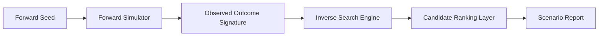

# society-reverse-sim

> **Forward + inverse social simulation for causal scenario reconstruction.**


## ◼ Background

Most simulation frameworks are excellent at forward prediction:

> "If we start here, what happens next?"

But post-event analysis often needs the inverse question:

> "Given this observed state, what likely generated it?"

This repository is dedicated to that inverse reconstruction challenge.

## ◼ Mission

Build a practical simulation framework that supports both forward generation and inverse hypothesis ranking with explainable confidence semantics.

## ◼ Vision

A durable research/engineering platform for teams modeling social dynamics, policy outcomes, and emergent behavior under uncertain causes.

## ◼ Philosophy

- **Non-uniqueness is expected** — inverse answers are candidate sets, not single truths.
- **Explainability over brute confidence** — ranking requires interpretable scoring dimensions.
- **Temporal context matters** — causality without timeline fidelity is weak causality.

## ◼ Core Outputs

| Output | Description |
|---|---|
| Forward trajectories | simulated outcome paths from seed conditions |
| Inverse candidate sets | plausible origin scenarios ranked by fit |
| Sensitivity views | parameter influence and fragility markers |
| Structured reports | machine-readable + human-readable summaries |

## ◼ Architecture



## ◼ MVP Scope

- forward state model definition
- outcome signature model
- baseline simulator
- inverse parameter search
- top-k candidate scenario ranking

## ◼ Operations Check

```bash
chmod +x scripts/ops-check.sh
./scripts/ops-check.sh
```

## ◼ Status

- [x] Repository bootstrap
- [ ] Forward simulator baseline
- [ ] Inverse search core
- [ ] Explainable scoring layer

## ◼ License

MIT (or project-defined license)
