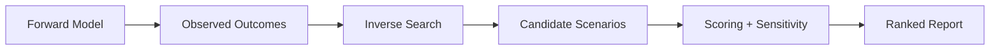

# society-reverse-sim

<p align="center">
  <strong>Forward + inverse social simulation</strong><br/>
  Simulate emergent outcomes and infer plausible origins from observed states.
</p>

<p align="center">
  
  
  
</p>

---

## Overview

`society-reverse-sim` addresses both directions of social simulation:

1. **Forward mode**: conditions + rules → outcomes
2. **Inverse mode**: outcomes → plausible generating conditions

The inverse problem is non-unique, so outputs are represented as candidate scenario sets with confidence bands.

---

## Why This Matters

Traditional simulators answer “what if we start here?”.
This project also asks “given what we observe now, what likely produced it?”.

---

## Core Deliverables

- Forward simulator (toy-world to scalable model)
- Inverse search engine over parameter/rule space
- Scenario ranking with explainability
- Structured reports (top-k plausible scenario sets)

---

## Planned Architecture



---

## MVP Scope

- Define forward state model
- Define outcome signature model
- Build baseline forward simulator
- Build inverse parameter search
- Return top-k plausible results

See: `docs/ROADMAP.md`

---

## Operations Check

```bash
chmod +x scripts/ops-check.sh
./scripts/ops-check.sh
```

Optional:

```bash
SRS_REPORT_FILE=/tmp/society-reverse-sim-report.json ./scripts/ops-check.sh
SRS_HISTORY_FILE=/tmp/society-reverse-sim-history.jsonl ./scripts/ops-check.sh
```

---

## Status

- [x] Repository bootstrap
- [ ] Forward simulator baseline
- [ ] Inverse search engine
- [ ] Scenario scoring + explainability

---

## License

MIT (or project-defined license).
