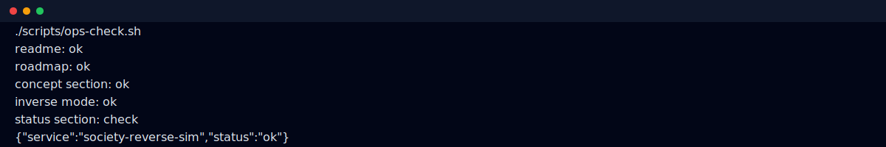

# society-reverse-sim

<p align="center">
  
</p>

<p align="center">
  <strong>Forward + inverse social simulation for causal scenario inference.</strong>
</p>

## Overview

This project targets both directions of simulation:

- **forward mode**: starting conditions → outcomes
- **inverse mode**: outcomes → plausible origins

Inverse outputs are treated as ranked candidate sets, not single-answer certainty.

## Why this is useful

When a system drifts into an unexpected social state, debugging the origin is often harder than predicting the future.

society-reverse-sim focuses on that inverse debugging problem.

## Terminal snapshot



## MVP scope

- forward state model
- outcome signature model
- baseline simulator
- inverse parameter search
- top-k scenario ranking

## Operations check

```bash
chmod +x scripts/ops-check.sh
./scripts/ops-check.sh
```

Optional:

```bash
SRS_REPORT_FILE=/tmp/society-reverse-sim-report.json ./scripts/ops-check.sh
SRS_HISTORY_FILE=/tmp/society-reverse-sim-history.jsonl ./scripts/ops-check.sh
```

## Status

- [x] bootstrap + roadmap
- [ ] forward simulator baseline
- [ ] inverse search core
- [ ] explainable scoring layer

## License

MIT (or project-defined license)
