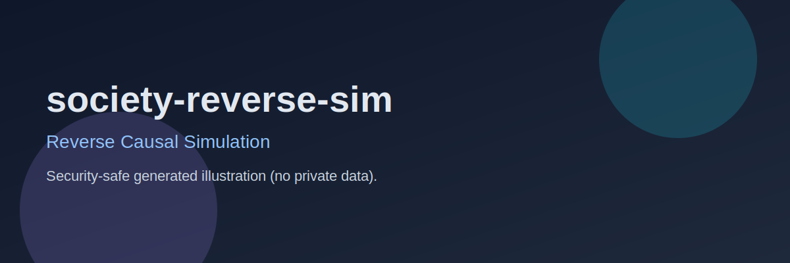

# society-reverse-sim

<p align="center">
  
</p>

<p align="center">
  <strong>Reverse Causal Simulation</strong><br/>
  Runs forward simulations and infers plausible origins from observed social states.
</p>

<p align="center">
  
  
</p>

---

## Table of Contents

- [Overview](#overview)
- [Why This Project](#why-this-project)
- [Core Capabilities](#core-capabilities)
- [Tech Stack](#tech-stack)
- [Quick Start](#quick-start)
- [Operations](#operations)
- [Roadmap](#roadmap)
- [Security & Privacy](#security--privacy)
- [Contributing](#contributing)
- [License](#license)

---

## Overview

Runs forward simulations and infers plausible origins from observed social states.

Inverse mode produces ranked candidate scenario sets with confidence bands.

## Why This Project

This repository exists to provide a practical, production-oriented foundation with clear operational visibility and repeatable workflows.

## Core Capabilities

- Structured runtime behavior with deterministic checks
- Ops-oriented scripts for health verification and reporting
- Clean handoff between development, validation, and reporting
- Incremental enhancements designed for continuous operation loops

## Tech Stack

`Python (planned), Simulation Engine, JSON outputs`

## Quick Start

```bash
chmod +x scripts/ops-check.sh
./scripts/ops-check.sh
```

## Operations

```bash
SRS_REPORT_FILE=/tmp/srs-report.json ./scripts/ops-check.sh
```

## Roadmap

- Improve monitoring depth and trend-based diagnostics
- Expand automation and report schema consistency
- Strengthen failure-mode handling and recovery behavior

## Security & Privacy

- Do not commit secrets, tokens, or private infrastructure details.
- Keep screenshots sanitized (no personal identifiers, no credential surfaces).
- Generated README images in this repo are synthetic and privacy-safe.

## Contributing

Issues and PRs are welcome. Please keep changes focused, tested, and operationally verifiable.

## License

MIT (or project-defined license).
